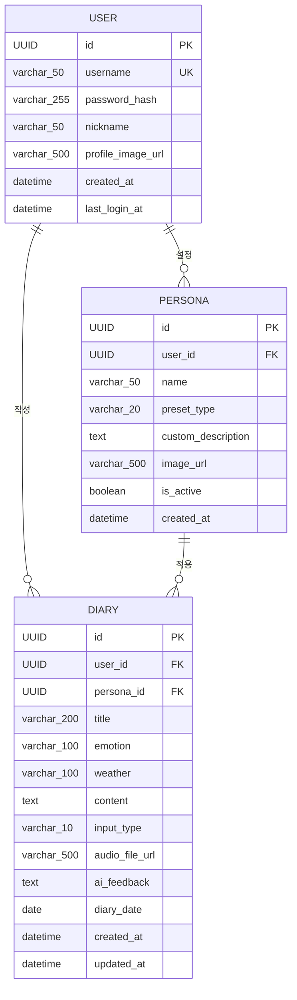

# 말벗이 내 손 안에 — 개발과정 기록

> 작성: 유동주 + Claude AI (claude-sonnet-4-6)
> 기간: 2026-03-28 ~ 2026-03-30
> 목표: 팀 원본(malbeot-diary) → React 모바일 앱(malbeot-diary2) 전환
> GitHub: https://github.com/dsic777/malbeot-diary2

---

## 개발 컨셉

> "하루에 한 번 쓰는 일기장"이 아닌 "언제든 말을 걸 수 있는 내 손 안의 절친"

팀 프로젝트 원본(바닐라 HTML/JS + OpenAI + Azure 유료 서비스)을 React 모바일 앱으로 재작성했다.
유료 Azure STT/TTS를 브라우저 내장 Web Speech API로 대체하고, AI는 Claude Haiku를 선택했다.
기술보다 사용성 — 폰 하나로 언제든 말을 거는 경험에 집중한다.

---

## 원본 vs 모바일 버전

| 항목 | 팀 원본 (malbeot-diary) | 모바일 버전 (malbeot-diary2) |
|------|------------------------|----------------------------|
| 프론트엔드 | 바닐라 HTML/CSS/JS | React 18 + Vite + Tailwind CSS |
| AI 모델 | OpenAI GPT-4o-mini | Claude Haiku (claude-haiku-4-5-20251001) |
| STT | Azure STT (유료) | Web Speech API (무료, 브라우저 내장) |
| TTS | Azure TTS 서버 (유료) | Web Speech Synthesis API (무료, 브라우저 내장) |
| 피드백 방식 | 스트리밍 (실시간 타이핑) | 완성 후 일괄 표시 |
| 검색 | 있음 | ✅ 구현 완료 (제목+내용 키워드) |
| 캘린더 | 없음 | ✅ 구현 완료 (감정·날씨·건수 표시) |
| 일기 수정 | 없음 | ✅ 구현 완료 |
| 배포 | Docker + Nginx | Docker + Nginx |

> ⚠️ 팀 원본 저장소(`solrimna/malbeot-diary`)와 로컬 복사본(`c:/proj3/malbeot-diary`)은 **참조 전용 — 절대 수정 금지**

---

## 기술 스택

| 구분 | 기술 | 선택 이유 |
|------|------|----------|
| 백엔드 | FastAPI + SQLAlchemy 2.0 (비동기) | 빠른 개발, async 지원 |
| DB | SQLite (개발) / PostgreSQL (운영) | 개발 편의 + 운영 안정성 |
| 인증 | JWT (python-jose + bcrypt) | Stateless, 모바일 친화적 |
| AI | Claude Haiku (Anthropic) | 저비용, 빠른 응답 |
| STT/TTS | Web Speech API (브라우저 내장) | 무료, HTTPS 환경에서 동작 |
| 프론트엔드 | React 18 + Vite + Tailwind CSS | SPA, 모바일 최적화 |
| 라우팅 | React Router DOM | |
| 배포 | Docker Compose + Nginx | 환경 일관성, EC2 최적화 |

---

## 개발 환경

### 로컬
- Windows 11, VSCode
- Python 가상환경: `c:\Portfolio\Malbeot2\backend\myEnv` (gitignore 등록)
- 코드 작성: 로컬에서

### 서버 (EC2)
- AWS EC2 t3.micro (ap-northeast-2a, 서울 리전), Ubuntu
- 공인 IP: 13.209.191.143
- 도메인: mymalbeot.duckdns.org (SSL: 2026-06-27 만료, 자동갱신 등록)
- HumanRM과 동일 서버 공유 (포트 분리)
- Docker Compose로 모든 서비스 관리

### 포트 구성

```
포트 80/443 → 말벗 frontend nginx (React + SSL)
내부 8000   → FastAPI 백엔드
내부 5432   → PostgreSQL

포트 80     → HumanRM nginx (기존, 말벗 HTTPS 전환 시 충돌 주의)
```

### 개발 흐름

```
로컬에서 코드 작성
    ↓
git push (GitHub: dsic777/malbeot-diary2)
    ↓
EC2: git pull + docker compose up --build
    ↓
브라우저/핸드폰에서 테스트 (HTTPS 필요 — STT/TTS)
    ↓
문제 발견 → 로컬 수정 → 반복
```

---

## ERD (총 3개 테이블 — 2026-03-28 기준)



> 테이블명을 클릭하면 상세 필드가 펼쳐집니다.

---

#### 👤 사용자

<details>
<summary>User — 사용자</summary>

| 필드명 | 타입 | KEY | 설명 |
|--------|------|-----|------|
| id | UUID | PK | uuid4 자동생성 |
| username | varchar(50) | UNIQUE | 로그인 아이디 |
| password_hash | varchar(255) | | bcrypt 암호화 |
| nickname | varchar(50) | | 화면 표시 이름 |
| profile_image_url | varchar(500) | | 프로필 이미지 (nullable) |
| created_at | datetime(tz) | | 서버 기본값 |
| last_login_at | datetime(tz) | | 마지막 로그인 (nullable) |

</details>

---

#### 📔 일기

<details>
<summary>Diary — 일기</summary>

> user_id → User, persona_id → Persona (nullable — 말벗 미선택 시 기본 공감형 적용)

| 필드명 | 타입 | KEY | 설명 |
|--------|------|-----|------|
| id | UUID | PK | uuid4 자동생성 |
| user_id | UUID | FK→User | 소유자 |
| persona_id | UUID | FK→Persona | 선택한 말벗 (nullable) |
| title | varchar(200) | | 제목 (nullable) |
| emotion | varchar(100) | | 감정 이모지 (기본: 평온) |
| weather | varchar(100) | | 날씨 이모지 (기본: 맑음) |
| content | text | | 일기 내용 (필수) |
| input_type | varchar(10) | | text / voice / mixed |
| audio_file_url | varchar(500) | | 음성 파일 URL (nullable) |
| ai_feedback | text | | Claude Haiku 피드백 (nullable) |
| diary_date | date | | 일기 날짜 (로컬 기준, 미래 허용) |
| created_at | datetime(tz) | | 서버 기본값 |
| updated_at | datetime(tz) | | 수정 시 갱신 (nullable) |

</details>

---

#### 🤝 말벗

<details>
<summary>Persona — 말벗 설정</summary>

| 필드명 | 타입 | KEY | 설명 |
|--------|------|-----|------|
| id | UUID | PK | uuid4 자동생성 |
| user_id | UUID | FK→User | 소유자 |
| name | varchar(50) | | 말벗 이름 |
| preset_type | varchar(20) | | empathy / advice / custom (nullable) |
| custom_description | text | | 직접 설정 내용 (nullable) |
| image_url | varchar(500) | | 말벗 이미지 (nullable) |
| is_active | boolean | | 활성 여부 (기본 true) |
| created_at | datetime(tz) | | 서버 기본값 |

</details>

---

## 화면 구성 (6개 페이지)

| 화면 | 경로 | 주요 기능 |
|------|------|----------|
| 로그인 | `/login` | JWT 로그인, "내 손 안의 절친" 컨셉 |
| 회원가입 | `/register` | 비밀번호 확인, 실시간 불일치 표시 |
| 목록/캘린더 | `/` | 📋목록·📅캘린더 탭, 검색, 하단 이야기 남기기 버튼 |
| 기록 보기 | `/diary/:id` | AI 피드백, TTS 토글, ✏️수정·🗑️삭제 버튼 |
| 이야기 남기기/수정 | `/write` | 텍스트+음성 입력, 커스텀 날짜 피커, 말벗 선택 |
| 말벗 설정 | `/personas` | 프리셋(공감형·조언형)/직접설정, 추가/삭제 |

---

## 프로젝트 구조

```
malbeot-diary2/
├── backend/
│   ├── app/
│   │   ├── api/v1/
│   │   │   ├── auth.py       — 로그인, 회원가입
│   │   │   ├── diary.py      — 일기 CRUD + 검색
│   │   │   ├── persona.py    — 페르소나 CRUD
│   │   │   ├── feedback.py   — AI 피드백 생성
│   │   │   └── router.py     — 라우터 통합
│   │   ├── core/
│   │   │   └── security.py   — JWT, bcrypt
│   │   ├── models/           — User, Diary, Persona
│   │   ├── schemas/          — 요청/응답 스키마
│   │   ├── services/         — 비즈니스 로직
│   │   ├── config.py         — 환경변수 설정
│   │   ├── database.py       — DB 연결 (비동기)
│   │   └── main.py           — FastAPI 앱 (redirect_slashes=False)
│   ├── requirements.txt      — 개발용 (SQLite)
│   ├── requirements.prod.txt — 운영용 (PostgreSQL)
│   └── Dockerfile
├── frontend/
│   ├── src/
│   │   ├── api/client.js     — API 호출 유틸리티 (토큰 자동 포함)
│   │   ├── hooks/useTTS.js   — TTS 훅 (localStorage 연동)
│   │   ├── pages/
│   │   │   ├── LoginPage.jsx
│   │   │   ├── RegisterPage.jsx
│   │   │   ├── DiaryListPage.jsx    — 목록 + 캘린더 탭 + 검색
│   │   │   ├── DiaryDetailPage.jsx  — 상세 + 피드백 + 수정/삭제
│   │   │   ├── DiaryWritePage.jsx   — 작성 + 음성 + 날짜피커
│   │   │   └── PersonaPage.jsx      — 말벗 설정
│   │   ├── App.jsx           — 라우팅 + PrivateRoute
│   │   ├── main.jsx
│   │   └── index.css         — 다크 테마, height: 100svh (S24 기준)
│   ├── nginx.conf            — 배포용 (HTTP→HTTPS 리다이렉트 + SSL)
│   ├── Dockerfile            — 멀티스테이지 빌드
│   └── vite.config.js        — Tailwind + API 프록시
├── docker-compose.yml
├── .env.example
└── README.md
```

---

## 개발 단계별 기록

---

### Step 1 — 백엔드 API 구성 ✅ (2026-03-28 완료)

**작업 내용**
- FastAPI 프로젝트 구조 세팅 (app/, api/v1/, models/, schemas/, services/)
- SQLAlchemy 2.0 비동기 엔진 구성 (`database.py`)
- 3개 테이블 모델 작성 (User, Diary, Persona)
- 인증 API: `POST /api/v1/auth/register`, `POST /api/v1/auth/login`
- JWT 발급·검증 (`core/security.py`) + bcrypt 패스워드 해싱
- 일기 CRUD: `GET/POST /api/v1/diaries/`, `GET/PUT/DELETE /api/v1/diaries/{id}`
- 검색: `GET /api/v1/diaries/?keyword=...` (제목 + 내용 LIKE 검색)
- 페르소나 CRUD: `GET/POST /api/v1/personas/`, `DELETE /api/v1/personas/{id}`
- AI 피드백 API: `POST /api/v1/feedback/` — Claude Haiku 호출, 마크다운 제거

**트러블슈팅**
- FastAPI 307 리다이렉트 시 Authorization 헤더 소실 → `redirect_slashes=False` + 엔드포인트 URL에 후행 `/` 명시

**학습 포인트**
- FastAPI의 `redirect_slashes=True`(기본)는 `/diaries` → `/diaries/` 307 리다이렉트 발생. 307은 메서드와 헤더를 보존하지만 브라우저/클라이언트에 따라 Authorization 헤더를 재전송하지 않는 경우가 있음. `redirect_slashes=False`로 비활성화하고 URL을 통일하는 것이 안전하다.

---

### Step 2 — React 프론트엔드 기본 화면 ✅ (2026-03-28 완료)

**작업 내용**
- Vite + React 18 프로젝트 생성, Tailwind CSS 설정
- `api/client.js` — axios 인스턴스, JWT Bearer 자동 첨부
- `App.jsx` — PrivateRoute (비로그인 시 /login 리다이렉트)
- 6개 페이지 기본 구현 (로그인, 회원가입, 목록, 상세, 작성, 말벗설정)
- `index.css` — 다크 테마, S24 기준 `height: 100svh`

**트러블슈팅**
- 브라우저 자동완성 오작동 — 회원가입 닉네임이 로그인 아이디에 자동완성 → `autoComplete="off"`, `autoComplete="new-password"` 추가
- AI 피드백에 `#`, `**` 등 마크다운 기호 표시 → 프롬프트에 "순수 텍스트로만" 지시 + 정규식 후처리 추가
- 하단 버튼 사라짐 — `min-height: 100svh`라서 콘텐츠 많으면 페이지 무한 확장 → `height: 100svh` + `overflow: hidden` + main에 `overflow-y: auto`

**학습 포인트**
- `min-height: 100svh`는 콘텐츠가 넘쳐도 페이지가 늘어나서 fixed 버튼이 뷰포트 아래로 내려간다. `height: 100svh` + `overflow: hidden`으로 컨테이너를 뷰포트에 고정시켜야 하단 버튼이 항상 보인다.

---

### Step 3 — TTS·STT·고급 기능 ✅ (2026-03-29 완료)

**작업 내용**
- `hooks/useTTS.js` — Web Speech Synthesis API 훅, localStorage ON/OFF 저장
- 헤더 🔊/🔇 토글, 기록 보기 진입·저장 후 자동 읽기, 뒤로가기 시 즉시 중단
- Web Speech Recognition API — 한국어(ko-KR), 실시간 중간 결과 표시
- 제목·내용 각각 독립 🎤 버튼 추가
- 캘린더 탭 — 감정 이모지 + 날씨 이모지 + 건수 표시, 셀 클릭 → 해당 날짜 일기 인라인
- 좌우 스와이프/마우스 드래그로 월 이동
- 커스텀 날짜 피커 — 달력 팝업, 요일 표시, 미래 날짜 허용
- 일기 수정 기능 — DiaryWritePage 재사용, 수정 완료 후 피드백 재생성 없음

**트러블슈팅 — Android 음성 중복 입력 (3차 시도 끝에 해결)**

1차: `processedCountRef`로 resultIndex 추적 → Android 내부 재시작 시 resultIndex가 0으로 리셋되어 효과 없음

2차: 세션 누적 텍스트 비교(`sessionFinalRef`) → 재시작 후 새 세션 텍스트가 이전 누적보다 짧아져서 slice 위치 틀어짐

3차: `continuous: false` + `onend` 자동재시작 ✅
```javascript
recognition.continuous = false   // 발화 1회 = 1세션, 중복 원천 차단
recognition.onend = () => {
  if (keepListeningRef.current) recognition.start()  // 자동 재시작
}
```

- 날짜 하루 전날 표시 — `toISOString()`이 UTC 기준 반환 (한국 UTC+9) → `getFullYear/getMonth/getDate`로 로컬 날짜 직접 계산
- 날씨 버튼 색상 미식별 → 더 선명한 색상으로 변경 (흐림: slate-400, 비: blue-400, 눈: sky-300, 바람: cyan-400)
- 캘린더 복수 일기 감정/날씨 혼선 → 마지막 입력 일기의 데이터 표시 (`entries[entries.length-1]`)

**학습 포인트**
- Android Chrome의 Web Speech API는 `continuous: true` 설정 시 발화 단위마다 세션을 내부적으로 종료/재시작하고 `resultIndex`를 0으로 리셋한다. 데스크톱 Chrome에서는 재현 안 됨 — 반드시 실기기 테스트가 필요하다.
- 해결 표준 패턴: `continuous: false` + `onend` 재시작. 발화 1회 = 1세션으로 격리하면 중복 자체가 불가능해진다.
- `toISOString()`은 UTC 기준이라 한국(UTC+9)에서 새벽 0~8시에 호출하면 전날 날짜가 반환된다. 날짜 처리는 항상 로컬 메서드(`getFullYear`, `getMonth`, `getDate`)를 사용한다.

---

### Step 4 — Docker 배포 ✅ (2026-03-29 완료)

**작업 내용**
- `backend/Dockerfile` — Python 3.11-slim, requirements.prod.txt
- `frontend/Dockerfile` — 멀티스테이지 (node 빌드 → nginx 서빙)
- `docker-compose.yml` — app(FastAPI) + frontend(nginx) + db(PostgreSQL)
- HumanRM 기존 서버에 포트 8080으로 추가 배포
- `.env.example` 작성, EC2에서 `.env` 설정 후 `docker compose up -d --build`

**실행 중인 컨테이너**

```
malbeot-diary2-frontend-1   0.0.0.0:8080→80/tcp  (nginx, React)
malbeot-diary2-app-1        내부 8000             (FastAPI)
malbeot-diary2-db-1         내부 5432             (PostgreSQL)
humanrm-nginx-1             0.0.0.0:80→80/tcp     (기존 유지)
```

**EC2 재배포 명령어**

```bash
ssh -i 키파일.pem ubuntu@13.209.191.143
cd ~/malbeot-diary2
git pull
docker compose down && docker compose up -d --build
docker ps
```

---

### Step 5 — HTTPS 설정 ✅ (2026-03-30 완료)

> STT/TTS는 브라우저 보안 정책상 HTTPS에서만 동작 — 도메인 + SSL 필수

**작업 내용**
1. DuckDNS 무료 도메인 발급: `mymalbeot.duckdns.org` (malbeot는 선점됨)
2. EC2 보안그룹 443 포트 오픈
3. Certbot으로 Let's Encrypt SSL 인증서 발급

```bash
docker stop humanrm-nginx-1          # 80포트 충돌 방지
sudo certbot certonly --standalone -d mymalbeot.duckdns.org
docker start humanrm-nginx-1
```

4. `frontend/nginx.conf` — HTTP→HTTPS 리다이렉트 + SSL 설정 + `/api/` 프록시
5. `docker-compose.yml` — 포트 `80:80`, `443:443` + `/etc/letsencrypt` 볼륨 마운트
6. SSL 자동갱신 cron 등록 (매월 1일 새벽 3시)

```bash
(sudo crontab -l 2>/dev/null; echo "0 3 1 * * certbot renew --quiet && docker restart malbeot-diary2-frontend-1") | sudo crontab -
```

**결과**: `https://mymalbeot.duckdns.org` — 음성 입력/TTS 정상 동작 ✅ SSL 만료: 2026-06-27

**트러블슈팅**
- `malbeot.duckdns.org` 이미 타인 선점 → `mymalbeot.duckdns.org`로 대체

**학습 포인트**
- Let's Encrypt 인증서 발급은 80포트로 도메인 소유권 확인을 한다. 기존 nginx가 80포트를 점유하고 있으면 certbot이 실패한다. docker stop으로 잠시 80포트를 비운 후 발급하고 재시작한다.
- DuckDNS는 인기 이름은 이미 선점되어 있다. 등록 전 확인이 필수.

---

## 코딩 규칙

> 다른 개발자가 코드를 해석할 수 있는 수준의 설명을 항상 포함한다.

### Python (FastAPI)

**파일 상단 docstring**
```python
"""
app/services/feedback_service.py
Claude Haiku API를 호출해 일기에 대한 AI 피드백을 생성한다.
마크다운 기호 제거 처리 포함.
"""
```

**함수 docstring** — 역할, 입력/출력, 예외 처리 이유
```python
async def generate_feedback(content: str, persona: Persona) -> str:
    """
    일기 내용과 페르소나 설정을 받아 Claude Haiku 피드백을 반환한다.
    프롬프트: 공감 위주, 3~4문장, 판단/조언 금지, 순수 텍스트.
    """
```

**인라인 주석** — 비자명한 설계 결정, 버그 수정 이유
```python
app = FastAPI(redirect_slashes=False)  # 307 리다이렉트 시 Authorization 헤더 소실 방지
diary_date = getLocalDate()            # toISOString() UTC 버그 방지 — 로컬 날짜 직접 계산
```

### React (JSX)

- 컴포넌트 상단에 한 줄 설명 주석
- 복잡한 로직(STT 재시작, TTS 자동 재생 조건 등)은 Why 주석 필수
- 상태(state) 변수는 약어 지양, 용도를 알 수 있는 이름으로

### 적용 범위

`models.py`, `services/`, `api/`, `hooks/`, React 컴포넌트 등 모든 파일에 동일 적용.

---

## 서버 이전 계획

### 현재: AWS EC2 t3.micro
- 디스크: 8GB (HumanRM과 공유 중)
- 비용: 캠프 기간 이후 유료 전환 예정
- 한계: 디스크 부족 시 `docker system prune` 주기적 필요

### 이전 예정: Oracle Cloud Free Tier
| 항목 | 사양 |
|------|------|
| CPU | AMD 1 core |
| RAM | 1GB |
| 디스크 | **47GB** |
| 비용 | **영구 무료** |
| 운영체제 | Ubuntu |

> 캠프 수료(2026-05-15) 후 Oracle Cloud로 이전 예정.
> Docker Compose 구조 동일하게 유지하여 이전 부담 최소화.

---

## 향후 계획

| 항목 | 설명 | 상태 |
|------|------|------|
| 팀 모바일 테스트 | 팀원들과 실사용 테스트 | 🔜 진행 예정 |
| 팀 원본 연동 | 팀 원본 백엔드와 DB 공유 | 📋 검토 중 |
| Oracle Cloud 이전 | EC2 → Oracle (영구 무료) | 📋 수료 후 예정 |

---

## 참조 프로젝트

| 프로젝트 | 경로 | 참조 내용 |
|----------|------|----------|
| malbeot-diary (팀 원본) | c:/proj3/malbeot-diary | 기능 명세, 원본 코드 (읽기 전용) |
| HumanRM | C:\Portfolio\HumanRM | Django 배포 구조, EC2 서버 공유 |

---

## GitHub

- 저장소: https://github.com/dsic777/malbeot-diary2
- 브랜치: main
- .gitignore: .env, backend/myEnv/, *.md (README.md·개발과정.md 제외)

### 커밋 이력

| 커밋 | 내용 |
|------|------|
| `840c34a` | feat: 일기 API 완성 (CRUD) |
| `32a1b97` | feat: 페르소나 API + Claude AI 피드백 API 완성 |
| `1bcdc47` | feat: React 프론트엔드 기본 화면 완성 |
| `d08813c` | feat: TTS 읽어주기 기능 추가 및 다크테마 디자인 완성 |
| `bee45a5` | feat: 페르소나 UI 추가 및 일기 작성 시 말벗 선택 연동 |
| `0893404` | feat: Docker 배포 환경 설정 추가 |
| `72f0e25` | docs: README 신규 작성 및 MD 문서 전면 업데이트 |
| `cd77ffc` | feat: 검색 기능 추가 및 로그인 화면 문구 추가 |
| `7480395` | feat: 캘린더 기능 추가 (목록/캘린더 탭 전환) |
| `0246c25` | feat: 감정/날씨 버튼 컬러 개선 및 캘린더 감정 표시 |
| `eeb5b79` | fix: 화면 여백·버튼 패딩·입력창 개선 |
| `7d9726d` | fix: 하단 버튼 사라짐 문제 수정 (레이아웃 높이 제한) |
| `2aeeef9` | feat: 날짜 커스텀 달력 피커 + 요일 표시 |
| `d97ba97` | fix: 기본 날짜 UTC→로컬(한국) 시간대로 수정 |
| `e4d5a76` | feat: 카드에 날씨 이모지 표시, 날씨 텍스트 제거 |
| `9228881` | feat: 캘린더 셀 개선 — 감정+날씨+건수 모두 표시 |
| `3729d3a` | feat: 캘린더 스와이프로 월 이동 |
| `fd161c5` | feat: 캘린더 마우스 드래그로 월 이동 추가 |
| `6d86d1f` | fix: 캘린더 월 이동 버튼 👈👉 아이콘으로 변경 |
| `d05feb0` | feat: 날짜 피커 달력 개선 — 스와이프 지원 |
| `c59241f` | feat: 일기 수정 기능 추가 |
| `51d051e` | fix: 삭제 버튼에 🗑️ 아이콘 추가 |
| `4c0a881` | fix: 날씨 버튼 선택 색상 더 선명하게 변경 |
| `7466236` | fix: 캘린더 복수 일기 시 마지막 입력 감정/날씨 표시 |
| `c19a639` | fix: 음성 중복 입력 방지 + 제목 음성 입력 버튼 추가 |
| `2f7f281` | fix: Android 음성 중복 입력 완전 수정 (세션 누적 방식) |
| `61912a8` | fix: 음성 중복 완전 해결 — continuous:false + onend 재시작 |
